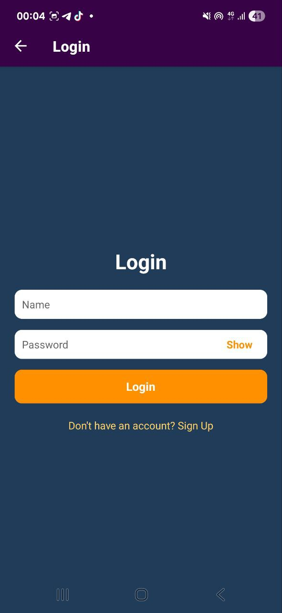
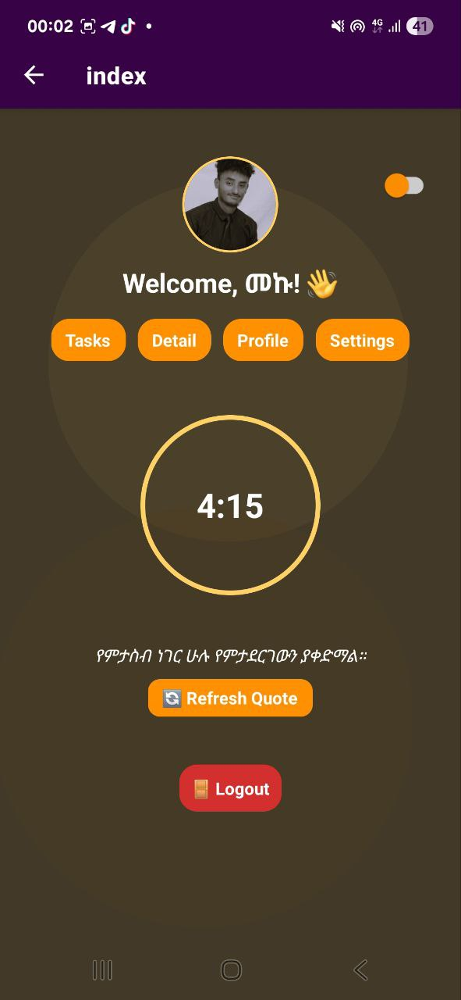
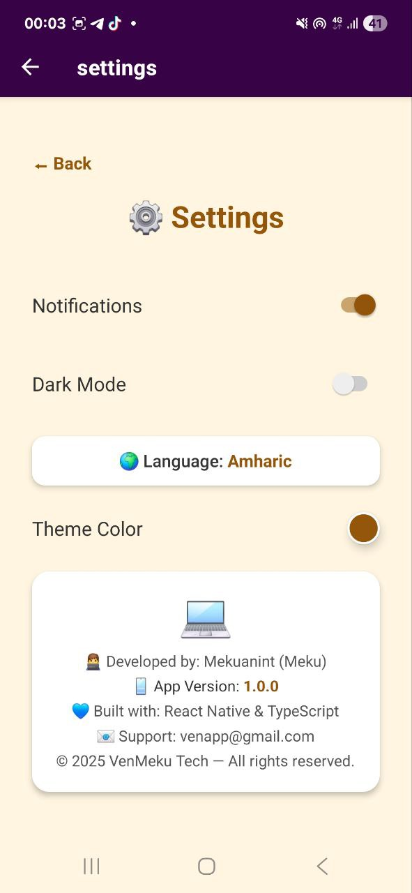

# 📝 VenMeku Todo — React Native App

A sleek and modern **To-Do app** built with **React Native** and **TypeScript**.  
Manage daily tasks easily with smooth performance, simple UI, and offline support.

---

## 🌟 Features
- ✅ Add, Edit, Delete, and Mark tasks as done  
- 👤 User Authentication (Login, Signup, Logout)  
- 🖼️ Profile page with user photo and name  
- 💾 Local data storage using AsyncStorage  
- ⚙️ Settings page (App info, Feedback, Version)  
- 📲 Responsive UI and smooth animations  

---

## 🧑‍💻 Tech Stack
- ⚛️ **React Native** — for cross-platform mobile development  
- 💙 **TypeScript** — for type-safe, scalable code  
- 💾 **AsyncStorage** — for local data management  

---

## 📱 Screenshots
| Login | Home | Profile | Settings |
|:--:|:--:|:--:|:--:|
|  |  |  |  |

---

## ⚙️ Installation & Setup

```bash
# 1. Clone the repo
git clone https://github.com/VenMeku/VenMeku-Todo-ReactNative.git

# 2. Move into the folder
cd VenMeku-Todo-ReactNative

# 3. Install dependencies
npm install

# 4. Run the app
npx react-native run-android
```

---

## 📂 Folder Structure

```
VenMeku-Todo-ReactNative/
│
├── src/
│   ├── components/
│   ├── screens/
│   ├── navigation/
│   ├── utils/
│   └── storage/
│
├── screenshots/
│   ├── login.png
│   ├── home.png
│   ├── profile.png
│   └── settings.png
│
├── App.tsx
├── package.json
└── README.md
```

---

## 🌍 About the Developer

👨‍💻 **Developer:** Mekuanint (Meku)  
📱 **Version:** 1.0.0  
💬 **Built With:** React Native & TypeScript  
📧 **Contact:** [venapp@gmail.com](mailto:venapp@gmail.com)  
🔗 **GitHub:** [VenMeku](https://github.com/VenMeku)  

---

⭐ **If you like this project, please give it a star on GitHub!**
